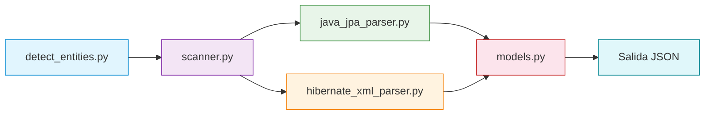

# java-entity-detector

Herramienta automatizada para detectar entidades de base de datos en repositorios Java legacy. Analiza anotaciones JPA y mapeos Hibernate XML sin compilar ni ejecutar el codigo fuente.

## Que hace

Recorre repositorios Java y extrae información de persistencia para generar diccionarios de datos y diagramas entidad-relacion (ER):

| Que detecta | Mecanismo |
|-------------|-----------|
| `@Entity`, `@Table` | Entidades JPA y sus tablas |
| `@Embeddable` | Tipos embebidos (composicion) |
| `@MappedSuperclass` | Superclases mapeadas (herencia) |
| `@Column` | Nombre de columna, tipo, restricciones |
| `@Id`, `@EmbeddedId` | Claves primarias |
| `@JoinColumn`, `@JoinTable` | Claves foraneas y tablas intermedias |
| `@OneToOne`, `@OneToMany`, `@ManyToOne`, `@ManyToMany` | Relaciones con cardinalidad |
| `@Inheritance` | Estrategia de herencia |
| `<class>`, `<id>`, `<property>` | Mapeos Hibernate XML |
| `<many-to-one>`, `<one-to-many>`, `<many-to-many>` | Relaciones en Hibernate XML |

## Requisitos

- Python 3.10+
- No requiere compilar ni instalar nada en los repositorios analizados

## Instalacion

```bash
git clone https://github.com/tu-usuario/java-entity-detector.git
cd java-entity-detector
pip install -r requirements.txt
```

## Uso

### Basico

```bash
python detect_entities.py -r ./repositories
```

Esto escanea todos los subdirectorios de `./repositories` e imprime el JSON resultante en pantalla.

### Guardar en archivo

```bash
python detect_entities.py -r ./repositories -o resultado.json
```

### Multiples repositorios

```bash
python detect_entities.py -r ./repo-a ./repo-b -o resultado.json
```

### JSON compacto

```bash
python detect_entities.py -r ./repositories --compact -o resultado.json
```

## Estructura de repositorios esperada

```
/repositories/
  ├── repo-legacy-1/
  │   └── src/main/java/com/empresa/model/
  │       ├── Cliente.java          (con @Entity)
  │       ├── Pedido.java           (con @Entity)
  │       └── mappings.hbm.xml      (Hibernate XML)
  ├── repo-legacy-2/
  │   └── src/main/java/...
  └── repo-spring/
      └── src/main/java/...
```

Cada subdirectorio dentro de `repositories/` se trata como un repositorio independiente. Se ignoran automaticamente los directorios: `.git`, `target`, `build`, `out`, `node_modules`, `bin`, `.gradle`, `.idea`, `.settings`.

## Formato de salida JSON

```json
{
  "version": "1.0",
  "scan_date": "2026-08-18T12:00:00+00:00",
  "repositories": ["repo-legacy-1", "repo-legacy-2"],
  "summary": {
    "entities": 15,
    "embeddables": 3,
    "mapped_superclasses": 2
  },
  "entities": [
    {
      "name": "Cliente",
      "table": "CLIENTES",
      "type": "JPA_ENTITY",
      "fully_qualified_name": "com.empresa.model.Cliente",
      "package": "com.empresa.model",
      "fields": [
        {
          "name": "id",
          "type": "Long",
          "column": "ID_CLIENTE",
          "primary_key": true,
          "nullable": false,
          "source": {
            "repository": "repo-legacy-1",
            "file": "src/main/java/com/empresa/model/Cliente.java",
            "line": 12
          }
        }
      ],
      "relations": [
        {
          "field": "pedidos",
          "target_type": "Pedido",
          "target_entity": "Pedido",
          "cardinality": "1:N",
          "mapped_by": "cliente",
          "source": {
            "repository": "repo-legacy-1",
            "file": "src/main/java/com/empresa/model/Cliente.java",
            "line": 25
          }
        }
      ],
      "annotations": ["@Entity", "@Table(name = \"CLIENTES\")"],
      "inheritance": null,
      "source": {
        "repository": "repo-legacy-1",
        "file": "src/main/java/com/empresa/model/Cliente.java",
        "line": 8
      },
      "evidence": {
        "kind": "jpa_annotation",
        "entity": "@Entity",
        "table": "@Table(name = \"CLIENTES\")"
      }
    }
  ],
  "embeddables": [
    {
      "name": "Direccion",
      "fully_qualified_name": "com.empresa.model.Direccion",
      "package": "com.empresa.model",
      "fields": [...]
    }
  ],
  "mapped_superclasses": [
    {
      "name": "BaseEntity",
      "fully_qualified_name": "com.empresa.model.BaseEntity",
      "fields": [...]
    }
  ]
}
```

### Campos de la entidad

| Campo | Descripcion |
|-------|-------------|
| `name` | Nombre simple de la clase Java |
| `table` | Nombre de la tabla en BD (de `@Table` o `<class table=...>`) |
| `type` | Tipo de mapeo: `JPA_ENTITY` o `HIBERNATE_XML` |
| `fully_qualified_name` | Nombre calificado completo (paquete + clase) |
| `package` | Paquete Java |
| `fields` | Lista de campos/columnas |
| `relations` | Relaciones con otras entidades |
| `inheritance` | Estrategia de herencia: `SINGLE_TABLE`, `JOINED`, `TABLE_PER_CLASS` |
| `evidence` | Evidencia cruda utilizada para la deteccion |

### Campos de un field

| Campo | Descripcion |
|-------|-------------|
| `name` | Nombre del atributo Java |
| `type` | Tipo Java del atributo |
| `column` | Nombre de la columna en BD |
| `primary_key` | `true` si es clave primaria |
| `nullable` | `true`/`false` si se especifico en `@Column` |
| `length` | Longitud maxima (si se especifico) |
| `precision`, `scale` | Para campos numericos |
| `unique` | Si tiene restriccion de unicidad |

### Campos de una relacion

| Campo | Descripcion |
|-------|-------------|
| `field` | Nombre del atributo Java |
| `target_type` | Tipo Java del destino (puede ser generic: `List<Pedido>`) |
| `target_entity` | Nombre simple de la entidad destino |
| `cardinality` | `1:1`, `1:N`, `N:1`, `N:M` |
| `join_column` | Columna FK (de `@JoinColumn`) |
| `join_table` | Tabla intermedia (de `@JoinTable`) |
| `mapped_by` | Campo inverso (de `mappedBy`) |

## Ejecutar tests

```bash
python tests/test_parsers.py
```

Los tests usan archivos fixture en `tests/fixtures/` que simulan diferentes escenarios de entidades JPA y Hibernate XML.

## Arquitectura

```
detect_entities.py              # Punto de entrada CLI
src/entity_detector/
  ├── models.py                 # Modelo de datos (dataclasses)
  ├── utils.py                  # Utilidades: AST, anotaciones, regex
  ├── java_jpa_parser.py        # Parser JPA (Tree-sitter)
  ├── hibernate_xml_parser.py   # Parser Hibernate XML
  └── scanner.py                # Scanner de repositorios
tests/
  ├── test_parsers.py           # Tests unitarios
  └── fixtures/                 # Archivos Java y XML de prueba
```

### Flujo de ejecucion



> Flujo detallado por modulo: [detect_entities](docs/DETECT_ENTITIES.md) | [scanner](docs/SCANNER.md) | [java_jpa_parser](docs/JAVA_JPA_PARSER.md) | [hibernate_xml_parser](docs/HIBERNATE_XML_PARSER.md) | [models](docs/MODELS.md) | [utils](docs/UTILS.md)

### Por que Tree-sitter?

- Analiza sin compilar: no necesita JDK, Maven ni Gradle
- Tolerante a errores de sintaxis: no falla si el codigo tiene problemas
- AST preciso: extrae anotaciones, tipos y generic correctamente
- Rápido: procesa miles de archivos por segundo

## Limitaciones conocidas

- No resuelve anotaciones personalizadas fuera de JPA/Hibernate
- No analiza clases que usan XML persistence.xml (solo .hbm.xml)
- No detecta queries JPQL ni SQL nativo
- No maneja anotaciones dinamicas (generadas por frameworks)
- Los tipos resueltos son strings, no tipos completos de Java

## Roadmap

- [ ] Soporte para `persistence.xml`
- [ ] Soporte para MyBatis mappers
- [ ] Analisis de queries SQL nativas
- [ ] Exportar a Mermaid/PlantUML para diagramas ER
- [ ] Exportar a CSV para diccionarios de datos
- [ ] Soporte para `@Lob`, `@Temporal`, `@Enumerated`
- [ ] Deteccion de indexes y unique constraints
