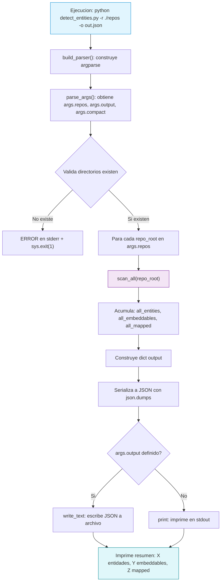

# detect_entities.py

Punto de entrada CLI del proyecto. Orquesta todo el proceso de escaneo y serializacion.

## Flujo detallado



## Funciones

### build_parser()

Construye el parser de argparse con los argumentos:

| Argumento | Tipo | Requerido | Descripcion |
|-----------|------|-----------|-------------|
| `-r, --repos` | `Path` (nargs="+") | Si | Directorios que contienen repositorios Java |
| `-o, --output` | `Path` | No | Archivo de salida JSON |
| `--pretty` | `bool` | No | Indentar JSON (por defecto: True) |
| `--compact` | `bool` | No | JSON sin indentacion |

### main(argv)

Funcion principal que:
1. Parsea argumentos con `build_parser()`
2. Valida que cada directorio en `args.repos` exista
3. Para cada `repo_root`, llama a `scan_all(repo_root)`
4. Acumula resultados en listas separadas
5. Construye el diccionario de salida con metadatos (version, scan_date, summary)
6. Serializa a JSON y escribe a archivo o stdout
7. Imprime resumen final

## Estructura de salida

```python
{
    "version": "1.0",
    "scan_date": "2026-08-19T12:00:00+00:00",
    "repositories": ["repo-1", "repo-2"],
    "summary": {
        "entities": 15,
        "embeddables": 3,
        "mapped_superclasses": 2
    },
    "entities": [...],
    "embeddables": [...],
    "mapped_superclasses": [...]
}
```

## Dependencias

- `scanner.scan_all` - Escaneo de repositorios
- `models.ScanResult` - Modelo de datos
- `argparse` - CLI
- `json` - Serializacion
- `pathlib.Path` - Manejo de rutas
