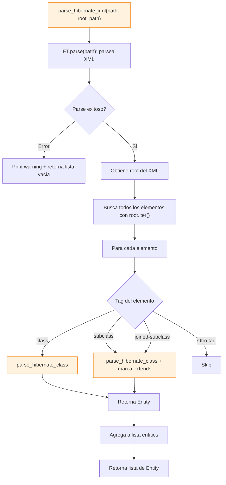

# hibernate_xml_parser.py

Parser de mapeos Hibernate XML (*.hbm.xml). Analiza archivos XML con ElementTree.

## Flujo detallado



## Funciones principales

### parse_hibernate_xml(path, root_path)

Funcion de entrada:
1. Parsea el XML con `xml.etree.ElementTree.parse()`
2. Obtiene el elemento root
3. Itera todos los elementos con `root.iter()`
4. Para cada `<class>`, `<subclass>`, `<joined-subclass>`, llama a `parse_hibernate_class()`
5. Retorna lista de objetos `Entity`

### parse_hibernate_class(class_element, repository, file_path)

Parsea un elemento `<class>` del XML:
1. Extrae `name` y `table` del elemento
2. Itera los hijos buscando:
   - `<id>` -> `parse_id_element()`
   - `<composite-id>` -> `parse_composite_id_element()`
   - `<property>` -> `parse_property_element()`
   - `<many-to-one>` -> `parse_many_to_one()`
   - `<one-to-many>` -> `parse_one_to_many()`
   - `<many-to-many>` -> `parse_many_to_many()`
   - `<one-to-one>` -> `parse_one_to_one()`
   - `<join>` -> Parsea campos adicionales
3. Retorna objeto `Entity` con `entity_type="HIBERNATE_XML"`

## Funciones de campos

### parse_id_element(element)

Parsea `<id>`:
- Extrae: `name`, `column`, `type`, `length`
- Busca `<column>` hijo si no hay atributo `column`
- Retorna `Field(primary_key=True)`

### parse_composite_id_element(element)

Parsea `<composite-id>`:
- Busca hijos `<key-property>`
- Para cada uno, extrae `name`, `column`, `type`, `length`
- Retorna lista de `Field(primary_key=True)`

### parse_property_element(element)

Parsea `<property>`:
- Extrae: `name`, `column`, `type`, `not-null`, `unique`, `length`
- Busca `<column>` hijo si no hay atributo `column`
- Retorna `Field(primary_key=False)`

## Funciones de relaciones

### parse_many_to_one(element)

Parsea `<many-to-one>`:
- Extrae: `name`, `class`, `column`, `not-null`
- Retorna `Relation(cardinality="N:1")`

### parse_one_to_many(element)

Parsea `<one-to-many>`:
- Extrae: `name`, `class`, `column`
- Retorna `Relation(cardinality="1:N")`

### parse_many_to_many(element)

Parsea `<many-to-many>`:
- Extrae: `name`, `class`, `table`, `column`
- Retorna `Relation(cardinality="N:M", join_table=table)`

### parse_one_to_one(element)

Parsea `<one-to-one>`:
- Extrae: `name`, `class`, `column`, `constrained`
- Retorna `Relation(cardinality="1:1")`

## Utilidades XML

### strip_ns(tag)

Elimina el namespace de un tag XML:
```
{http://www.hibernate.org/hbm/3.0}class -> class
```

### get(element, attr)

Obtiene un atributo de un elemento XML, o `None` si no existe.

## Soporte de herencia

- `<class>` -> Entidad principal
- `<subclass name="..." extends="...">` -> Subclase con herencia
- `<joined-subclass name="..." extends="...">` -> Subclase con join

## Dependencias

- `xml.etree.ElementTree` - Parsing XML
- `utils.repository_name` - Nombre del repositorio
- `models` - Dataclasses (Entity, Field, Relation, etc.)
