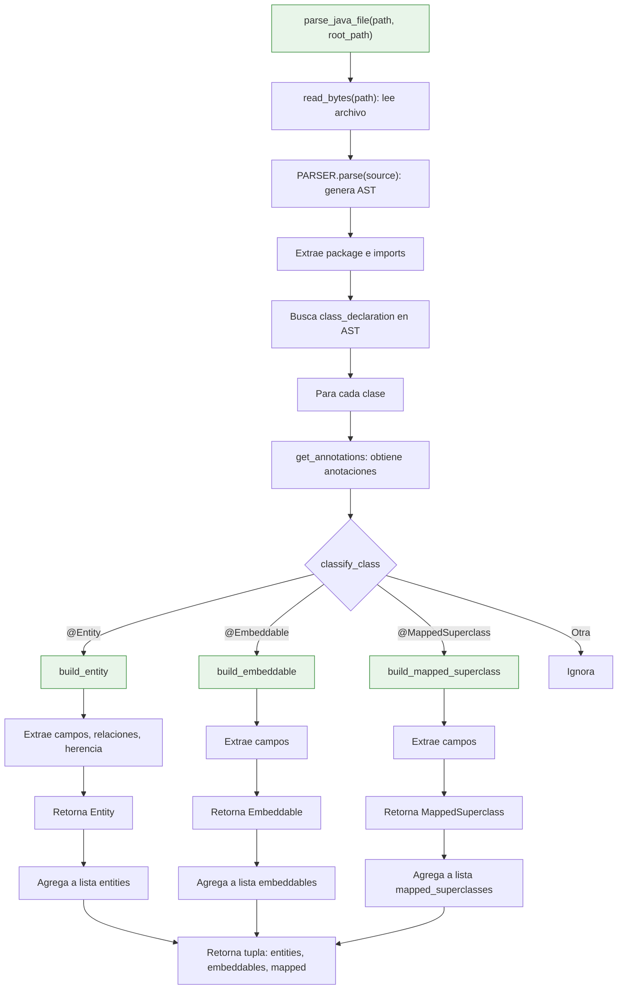

# java_jpa_parser.py

Parser JPA basado en Tree-sitter. Analiza archivos .java para detectar entidades.

## Flujo detallado



## Funciones principales

### parse_java_file(path, root_path)

Funcion de entrada:
1. Lee el archivo como bytes UTF-8
2. Lo parsea con Tree-sitter para obtener el AST
3. Extrae package y imports
4. Busca todas las `class_declaration` en el AST
5. Para cada clase, clasifica por anotaciones
6. Retorna `(entities, embeddables, mapped_superclasses)`

### classify_class(annotations)

Clasifica una clase segun sus anotaciones:
- `@Entity` -> `"entity"`
- `@Embeddable` -> `"embeddable"`
- `@MappedSuperclass` -> `"mapped_superclass"`
- Otra -> `None`

## Funciones de campos

### extract_fields(class_node, source, repository, file_path)

Extrae todos los campos de una clase Java:
1. Busca `class_body` en el nodo de clase
2. Para cada `field_declaration`, llama a `parse_field()`
3. Retorna lista de objetos `Field`

### parse_field(field_node, source, repository, file_path)

Parsea un campo individual:
1. Extrae anotaciones con `get_annotations()`
2. Extrae tipo con `extract_type()`
3. Extrae nombre del `variable_declarator`
4. Busca `@Column` para nombre de columna
5. Busca `@Id` / `@EmbeddedId` para PK
6. Extrae atributos: nullable, length, precision, scale, unique
7. Retorna objeto `Field`

## Funciones de relaciones

### extract_relations(class_node, source, repository, file_path, imports)

Extrae relaciones entre entidades:
1. Para cada `field_declaration`, llama a `parse_relation_field()`
2. Retorna lista de objetos `Relation`

### parse_relation_field(field_node, source, repository, file_path, imports)

Parsea un campo con anotacion de relacion:
1. Busca anotaciones de relacion en `RELATION_ANNOTATIONS`
2. Obtiene cardinalidad del mapa `RELATION_CARDINALITY`
3. Resuelve tipo destino con `resolve_relation_target()`
4. Extrae `@JoinColumn` y `@JoinTable`
5. Extrae `mappedBy`, `cascade`, `fetch`, `orphanRemoval`
6. Retorna objeto `Relation`

### resolve_relation_target(field_type, annotation_name, imports)

Resuelve el tipo destino:
- Para colecciones (`List<Pedido>`), extrae el tipo interior
- Retorna `(target_type_raw, target_entity_name)`

## Funciones de herencia

### extract_inheritance(class_node, source)

Extrae estrategia de herencia de `@Inheritance`:
- `SINGLE_TABLE`, `JOINED`, `TABLE_PER_CLASS`
- Por defecto: `SINGLE_TABLE`

## Constructores de modelos

- `build_entity()` -> `Entity`
- `build_embeddable()` -> `Embeddable`
- `build_mapped_superclass()` -> `MappedSuperclass`

## Constantes

```python
RELATION_CARDINALITY = {
    "OneToOne": "1:1",
    "OneToMany": "1:N",
    "ManyToOne": "N:1",
    "ManyToMany": "N:M",
}

RELATION_ANNOTATIONS = frozenset(RELATION_CARDINALITY.keys())
```

## Dependencias

- `tree_sitter` - Parsing de AST
- `utils` - Funciones compartidas (PARSER, get_annotations, etc.)
- `models` - Dataclasses (Entity, Field, Relation, etc.)
