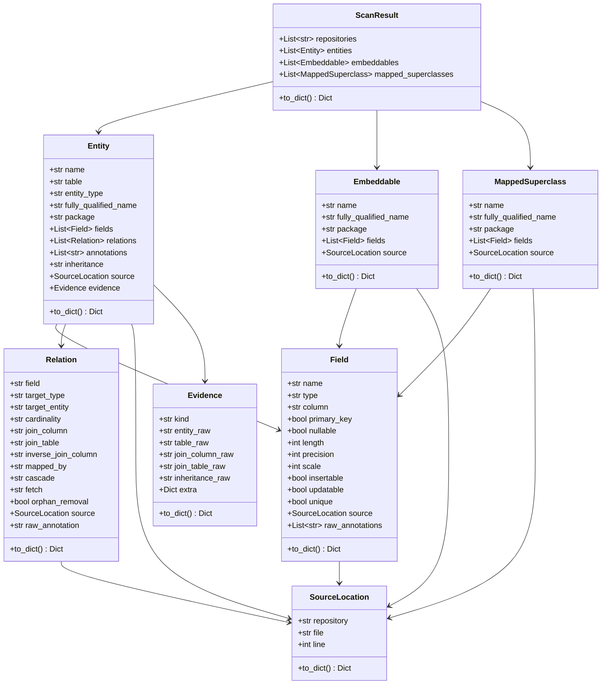

# models.py

Modelo de datos normalizado para entidades de persistencia. Define las estructuras que representan entidades, campos, relaciones y metadatos.

## Estructura de clases

## Clases

### ScanResult

Resultado completo de un escaneo de repositorios.

| Campo | Tipo | Descripcion |
|-------|------|-------------|
| `repositories` | `List[str]` | Nombres de repositorios escaneados |
| `entities` | `List[Entity]` | Entidades encontradas |
| `embeddables` | `List[Embeddable]` | Tipos embebidos encontrados |
| `mapped_superclasses` | `List[MappedSuperclass]` | Superclases mapeadas |

### Entity

Entidad de base de datos detectada en el codigo Java.

| Campo | Tipo | Descripcion |
|-------|------|-------------|
| `name` | `str` | Nombre simple de la clase |
| `table` | `str` | Nombre de la tabla en BD |
| `entity_type` | `str` | `"JPA_ENTITY"` o `"HIBERNATE_XML"` |
| `fully_qualified_name` | `Optional[str]` | Paquete + clase |
| `package` | `Optional[str]` | Paquete Java |
| `fields` | `List[Field]` | Campos/columnas |
| `relations` | `List[Relation]` | Relaciones con otras entidades |
| `annotations` | `List[str]` | Anotaciones raw |
| `inheritance` | `Optional[str]` | Estrategia de herencia |
| `source` | `Optional[SourceLocation]` | Ubicacion en codigo fuente |
| `evidence` | `Optional[Evidence]` | Evidencia de deteccion |

### Embeddable

Tipo embebido (composicion) detectado via `@Embeddable`.

| Campo | Tipo | Descripcion |
|-------|------|-------------|
| `name` | `str` | Nombre de la clase |
| `fully_qualified_name` | `Optional[str]` | Paquete + clase |
| `package` | `Optional[str]` | Paquete Java |
| `fields` | `List[Field]` | Campos del tipo embebido |
| `source` | `Optional[SourceLocation]` | Ubicacion en codigo fuente |

### MappedSuperclass

Superclase mapeada detectada via `@MappedSuperclass`.

| Campo | Tipo | Descripcion |
|-------|------|-------------|
| `name` | `str` | Nombre de la clase |
| `fully_qualified_name` | `Optional[str]` | Paquete + clase |
| `package` | `Optional[str]` | Paquete Java |
| `fields` | `List[Field]` | Campos de la superclase |
| `source` | `Optional[SourceLocation]` | Ubicacion en codigo fuente |

### Field

Campo de una entidad, mapeado a una columna de base de datos.

| Campo | Tipo | Descripcion |
|-------|------|-------------|
| `name` | `str` | Nombre del atributo Java |
| `type` | `str` | Tipo Java del atributo |
| `column` | `str` | Nombre de la columna en BD |
| `primary_key` | `bool` | `true` si es clave primaria |
| `nullable` | `Optional[bool]` | Si permite nulos |
| `length` | `Optional[int]` | Longitud maxima |
| `precision` | `Optional[int]` | Precision numerica |
| `scale` | `Optional[int]` | Escala numerica |
| `insertable` | `Optional[bool]` | Si es insertable |
| `updatable` | `Optional[bool]` | Si es actualizable |
| `unique` | `Optional[bool]` | Si tiene restriccion unica |
| `source` | `Optional[SourceLocation]` | Ubicacion en codigo fuente |
| `raw_annotations` | `List[str]` | Anotaciones raw del campo |

### Relation

Relacion entre dos entidades.

| Campo | Tipo | Descripcion |
|-------|------|-------------|
| `field` | `str` | Nombre del atributo Java |
| `target_type` | `str` | Tipo Java del destino |
| `target_entity` | `Optional[str]` | Nombre simple de la entidad destino |
| `cardinality` | `str` | `"1:1"`, `"1:N"`, `"N:1"`, `"N:M"` |
| `join_column` | `Optional[str]` | Columna FK |
| `join_table` | `Optional[str]` | Tabla intermedia |
| `inverse_join_column` | `Optional[str]` | Columna FK inversa |
| `mapped_by` | `Optional[str]` | Campo inverso |
| `cascade` | `Optional[str]` | Tipo de cascade |
| `fetch` | `Optional[str]` | Tipo de fetch |
| `orphan_removal` | `Optional[bool]` | Si elimina huerfanos |
| `source` | `Optional[SourceLocation]` | Ubicacion en codigo fuente |
| `raw_annotation` | `Optional[str]` | Anotacion raw |

### SourceLocation

Ubicacion de un elemento en el codigo fuente.

| Campo | Tipo | Descripcion |
|-------|------|-------------|
| `repository` | `str` | Nombre del repositorio |
| `file` | `str` | Ruta relativa del archivo |
| `line` | `int` | Numero de linea |

### Evidence

Evidencia cruda que el parser utilizo para identificar un elemento.

| Campo | Tipo | Descripcion |
|-------|------|-------------|
| `kind` | `str` | Tipo de evidencia (`"jpa_annotation"`, `"hibernate_xml"`) |
| `entity_raw` | `Optional[str]` | Anotacion `@Entity` raw |
| `table_raw` | `Optional[str]` | Anotacion `@Table` raw |
| `join_column_raw` | `Optional[str]` | Anotacion `@JoinColumn` raw |
| `join_table_raw` | `Optional[str]` | Anotacion `@JoinTable` raw |
| `inheritance_raw` | `Optional[str]` | Anotacion `@Inheritance` raw |
| `extra` | `Dict[str, str]` | Datos adicionales |

## Serializacion

Todas las clases implementan `to_dict()` que retorna un diccionario serializable a JSON. Solo incluye campos que no son `None` o listas vacias.
