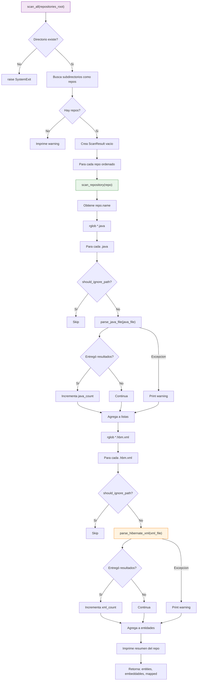

# scanner.py

Escanea repositorios Java buscando archivos .java y .hbm.xml.

## Flujo detallado

## Funciones

### scan_all(repositories_root)

Funcion principal que:
1. Valida que el directorio exista
2. Busca subdirectorios que no empiecen con `.`
3. Para cada subdirectorio, llama a `scan_repository()`
4. Acumula resultados en un `ScanResult`
5. Retorna el `ScanResult` completo

### scan_repository(repository_path)

Escanea un repositorio individual:
1. Busca todos los `*.java` recursivamente
2. Para cada `.java`, verifica que no este en directorios ignorados
3. Llama a `parse_java_file()` y acumula resultados
4. Busca todos los `*.hbm.xml` recursivamente
5. Para cada `.hbm.xml`, verifica que no este en directorios ignorados
6. Llama a `parse_hibernate_xml()` y acumula resultados
7. Retorna tupla `(entities, embeddables, mapped_superclasses)`

## Directorios ignorados

Definidos en `utils.py`:
- `.git`, `target`, `build`, `out`, `node_modules`
- `bin`, `test-output`, `.gradle`, `.idea`, `.settings`

## Dependencias

- `java_jpa_parser.parse_java_file` - Parser JPA
- `hibernate_xml_parser.parse_hibernate_xml` - Parser Hibernate XML
- `models.ScanResult` - Modelo de datos
- `utils.should_ignore_path` - Verificacion de directorios
